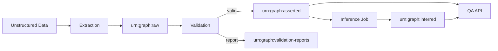
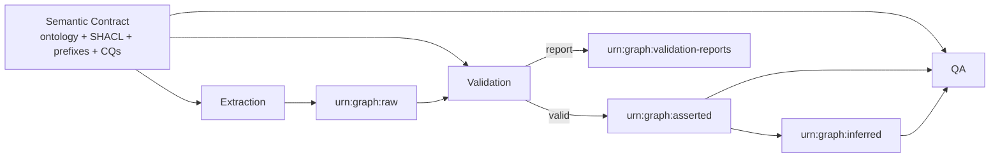

# Architecture

## Pipeline Flow

## Semantic Contract Leverage

## Step-By-Step Walkthrough

This walkthrough explains which files are used at each stage, how the semantic
contract is applied, and what output is produced for the next stage.

### 1. Unstructured Input Is Collected

- Primary unstructured input file:
  - `examples/unstructured-retail-order.txt`
- Purpose:
  - Provide realistic retail order text with fields such as order id, date,
    customer, store, and item lines.
- Output for next step:
  - Parsed retail facts prepared as RDF triples in `urn:graph:raw`.

### 2. Semantic Contract Is Loaded

- Contract files used as source of truth:
  - `contracts/ontology/core.ttl`
  - `contracts/shapes/core.shacl.ttl`
  - `contracts/competency-questions/cq-01-people.rq`
  - `contracts/competency-questions/cq-02-top-products.rq`
  - `contracts/competency-questions/cq-03-order-totals.rq`
- How the contract is leveraged:
  - Ontology terms define allowed classes/properties (Customer, Product, Order,
    OrderLine, Store, and related predicates).
  - SHACL defines structural and arithmetic constraints.
  - Competency questions define business outcomes the graph should answer.
- Output for next step:
  - Contract-conformant RDF vocabulary and validation criteria used by
    extraction and validation.

### 3. Extraction Writes Raw Graph

- Inputs used:
  - `examples/unstructured-retail-order.txt`
  - `contracts/ontology/core.ttl`
- Process outcome:
  - Retail entities and relations are materialized to RDF using ontology terms.
  - Data is written to `urn:graph:raw`.
- Intermediate output (for validation):
  - Raw triples for Customer, Store, Product, Order, and OrderLine,
    including quantities, prices, and totals.

### 4. Validation Checks And Promotion Decision

- Inputs used:
  - `urn:graph:raw` (extracted triples)
  - `contracts/shapes/core.shacl.ttl`
- How the contract is leveraged:
  - SHACL datatype/cardinality checks.
  - SHACL SPARQL constraints for line arithmetic and order rollups.
  - Additional business-rule checks for duplicate order identifiers and SKU
    naming consistency.
- Outputs:
  - Validation report triples in `urn:graph:validation-reports`.
  - If conformant: promoted triples in `urn:graph:asserted`.
  - If non-conformant: no promotion to asserted graph.

### 5. Inference Materializes Derived Facts

- Input used:
  - `urn:graph:asserted`
- Process outcome:
  - Derived facts are generated (for example customer-to-product purchasing
    links inferred from orders and lines).
- Output for next step:
  - Derived triples in `urn:graph:inferred`.

### 6. QA Uses Asserted + Inferred Graphs

- Inputs used:
  - `urn:graph:asserted`
  - `urn:graph:inferred`
  - Competency question files under `contracts/competency-questions/`
- How the contract is leveraged:
  - Query templates and intent mapping align to ontology entities/properties.
  - Result interpretation is grounded in the same semantic contract.
- Outputs:
  - Structured query result rows.
  - Natural-language narrative summary (`narrative`) with source indicator
    (`narrativeSource`: `llm` or `fallback`).

### 7. Feedback Loop For Contract Evolution

- Inputs used:
  - Validation reports in `urn:graph:validation-reports`
  - QA gaps identified via competency questions
- Process outcome:
  - Contract refinements in ontology/shapes/CQs.
- Output for next cycle:
  - Updated contract files in `contracts/` that improve extraction quality,
    validation precision, and QA coverage.
